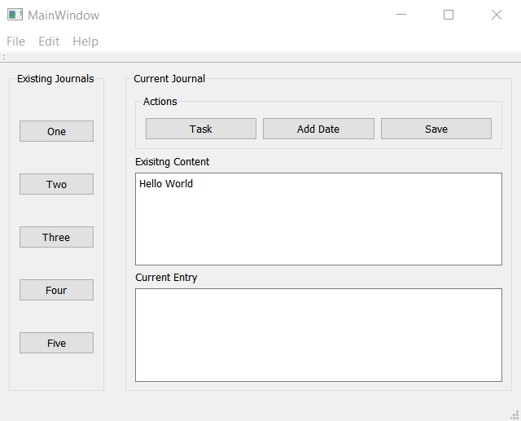

# JournalManager
a Qt desktop app that manages my journals.

A learning project, implementing a C++ app, both logic and GUI.

## Description
I like to keep track of various facts/events/tasks, and I usually have a txt file for each domain where I record this information.
I am creating this app to make it easier to add entries to different journals without having to keep opening and closing them manually.
The app will do that for me: all I have to do now is to select a journal from the left panel, and type an entry in the right hand panel.

## Functionality

At the moment, upon loading the app, a new folder is created inside the Home folder, called myJournals.

The user can choose to create a New journal or to Load an existing one.

The left panel displays the names of the available journals.

The right panel is used to add new entries.

